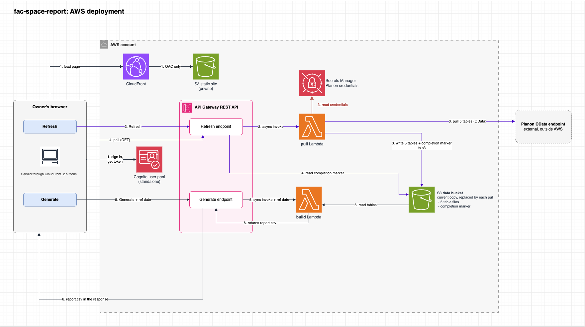

# Facility Space Report

## Index

| Section | Purpose |
|---------|---------|
| [Overview](#overview) | What this is and who it is for |
| [Description](#description) | Technology stack and repository structure |
| [Architecture](#architecture) | Diagram of the deployment |
| [Deployment](#deployment) | Prerequisites and install steps |
| [Configuration Reference](#configuration-reference) | The settings you can change |
| [Usage](#usage) | Running the report, and how it is built |
| [License](#license) | Project licensing details |
| [Collaboration](#collaboration) | Contact information for the team |
| [Disclaimers](#disclaimers) | Legal and usage disclaimers |

## Overview

A rebuild of Cal Poly's annual CSU facility report, the CSV the campus sends the Chancellor's
Office each year. Planon produced it through its Data Aggregation Manager, which retires in
December 2026. This produces the same report from Planon's data, outside Planon. Built with Cal
Poly DxHub.

It is for the facilities staff who own the report. They sign in to one page with two buttons:
**Refresh** copies the current data out of Planon, and **Generate** builds the report for a
reference date and downloads it as a CSV.

No Planon-side logic is carried over. The report is rebuilt from five raw Planon tables, and
the rules for every column are written down in
[`docs/report-column-paths.md`](docs/report-column-paths.md).

## Description

**Tech stack overview** (AWS-native):

- **Page:** a static, dependency-free HTML/JS page in a private S3 bucket, served through CloudFront
- **Sign-in:** a standalone Amazon Cognito user pool with Cognito's managed login pages. No self sign-up; an admin creates each account
- **API:** API Gateway REST API. Every method requires a Cognito token
- **Pull:** a Python Lambda, started asynchronously by Refresh, that copies five tables from Planon's OData endpoint into an S3 data bucket and writes a completion marker the page polls for
- **Build:** a Python Lambda, called synchronously by Generate, that builds the report from those tables and returns it as `report.csv`
- **Secrets:** the Planon login is kept in AWS Secrets Manager, entered after deploy and never in the repo or the template
- **External dependency:** Planon's OData endpoint (`planon.calpoly.edu`) is the only thing outside AWS
- **Infrastructure:** AWS CDK (Python)

**Repository structure:**

- `cdk/` - the CDK app (`fac_space_report/stack.py`), the two Lambda handlers (`functions/`) and the page (`site/`)
- `pipeline/` - the report logic (`build_report.py`) and a script that diffs our output against Planon's (`compare.py`). The build Lambda runs `build_report.py` unchanged
- `connector/` - the Planon OData client. The pull Lambda runs it unchanged
- `docs/` - the [install guide](docs/install.md), the architecture diagram and the column reference

No Cal Poly facility data is committed. The repo holds code and documentation only.

## Architecture



The numbers are the order things happen. The editable source is
[`docs/aws-deployment.drawio`](docs/aws-deployment.drawio).

## Deployment

**[`docs/install.md`](docs/install.md) is the install guide**: prerequisites, `cdk deploy`,
the three commands to run from its output, and how to tear it down. Read it before you deploy.

**Prerequisites:** AWS credentials, Python 3.10+, Node.js 20+, the CDK CLI, Docker running, and a
bootstrapped account/region.

**Steps:**

```bash
cd cdk
python3 -m venv .venv
source .venv/bin/activate
python -m pip install -r requirements.txt

cdk bootstrap   # once per account and region
cdk deploy
```

`cdk deploy` provisions everything in the diagram and prints the page's URL, plus
ready-to-paste commands that store the Planon login and create a sign-in. CloudFront makes the
first deploy take around ten minutes. Tear down with `cdk destroy`, and see
[the install guide](docs/install.md#6-tearing-down) for what it leaves behind.

## Configuration Reference

There is no config file. The settings are constants in the CDK code, read at synth. All three
can be changed and redeployed; each updates in place.

- **`REQUIRE_MFA`** (top of `cdk/fac_space_report/stack.py`, default `False`) - when `True`,
  sign-in requires an authenticator app, and Cognito walks each user through setting one up
- **`API_LOGGING`** (same place, default `False`) - when `True`, API Gateway writes an access
  log (who called what, with their email) and an error log. It needs a one-time account
  setting first, see [the install guide](docs/install.md#2-settings)
- **`env=`** (in `cdk/app.py`, unset) - pins the stack to one account and region. Unset, it
  goes wherever your credentials point

Both switches start off so a first deploy needs nothing set up in the account beforehand. Turn
both on before real users.

## Usage

**Running the report.** Open the page, sign in, and click **Refresh from Planon**. A refresh
replaces all five tables and takes a few minutes; the page shows the row counts when it
finishes. Then pick a reference date and click **Generate report**. The report shows on the
page, and **Download CSV** saves it. Refresh again whenever you need newer data; Generate
always uses the last refresh.

**How the report is built.** Five Planon tables: `Property`, `PropertyDetails`, `SpaceUsage`,
`SpaceStandard` and `BaseCodes`. A report row is a **facility**, a group of buildings sharing
`PropertyDetails.FreeString13`. That field points at one member, the **anchor**, and every
descriptive value comes from it. Areas sum across the whole group. Two filters, both from the
requirements doc: the reference date, and `PropertyDetails.FreeString14` ("Reported to
Chancellors Office") = Y. Column by column: [`docs/report-column-paths.md`](docs/report-column-paths.md).

**Difference from Planon.** One rule differs. Where a facility has gross area but no
assignable area, Planon prints `0` for EFFC and we print blank, which is what the requirements
doc asks for. Two facility names also look different, because Planon's export can't hold the
characters `ʔ` and `ʸ` and prints `?` instead.

**Running it locally.** The same report can be built on a laptop with no AWS at all, and
checked against Planon's own export. See [`pipeline/README.md`](pipeline/README.md).

## License

MIT. See [LICENSE](LICENSE).

## Collaboration

Thanks for your interest in our solution. Having specific examples of replication and cloning
allows us to continue to grow and scale our work. If you clone or download this repository, kindly
shoot us a quick email to let us know you are interested in this work!

[wwps-cic@amazon.com]

## Disclaimers

Customers are responsible for making their own independent assessment of the information in this document.

This document:

(a) is for informational purposes only,

(b) references AWS product offerings and practices, which are subject to change without notice,

(c) does not create any commitments or assurances from AWS and its affiliates, suppliers or licensors. AWS products or services are provided "as is" without warranties, representations, or conditions of any kind, whether express or implied. The responsibilities and liabilities of AWS to its customers are controlled by AWS agreements, and this document is not part of, nor does it modify, any agreement between AWS and its customers, and

(d) is not to be considered a recommendation or viewpoint of AWS.

Additionally, you are solely responsible for testing, security and optimizing all code and assets on GitHub repo, and all such code and assets should be considered:

(a) as-is and without warranties or representations of any kind,

(b) not suitable for production environments, or on production or other critical data, and

(c) to include shortcuts in order to support rapid prototyping such as, but not limited to, relaxed authentication and authorization and a lack of strict adherence to security best practices.

All work produced is open source. More information can be found in the GitHub repo.
